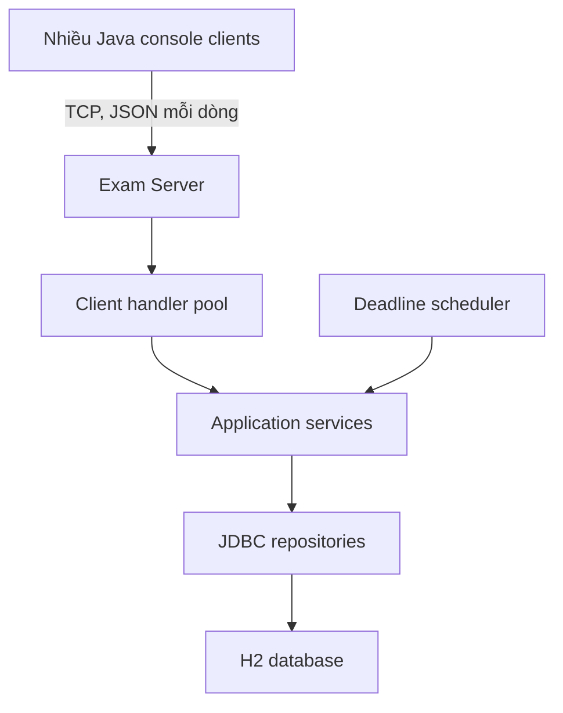

# Online Examination System

> **Trạng thái:** tài liệu thiết kế và kế hoạch triển khai cho **Topic 4 – Java Concurrent Application**. Cấu trúc, lệnh chạy và test bên dưới là mục tiêu triển khai; chưa tuyên bố mã nguồn đã tồn tại hoặc kết quả đo đã được thực hiện.

## 1. Thông tin dự án

| Mục | Nội dung |
| --- | --- |
| Môn học | Java Software Development, năm học 2026–2027 |
| Nhóm / giảng viên / thành viên | Điền trước khi nộp |
| Hướng đề tài | Topic 4 – Java Concurrent Application |
| Ứng dụng | Online Examination System |

## 2. Vấn đề, mục tiêu và phạm vi

Khi nhiều sinh viên cùng làm một bài thi, hệ thống phải xử lý các kết nối và lượt nộp bài đồng thời mà không làm mất câu trả lời, chấm trùng hoặc nhận bài quá hạn. Một luồng xử lý tuần tự cho mọi thí sinh sẽ khiến người đến sau phải chờ người đến trước; dữ liệu dùng chung cũng dễ phát sinh race condition nếu cập nhật thiếu kiểm soát.

Mục tiêu: cho phép giảng viên tạo và công bố bài thi trắc nghiệm; sinh viên đăng nhập, bắt đầu làm bài, lưu câu trả lời và nộp bài; server tự kết thúc khi hết hạn, chấm điểm và hiển thị kết quả, bảng xếp hạng. Trọng tâm kỹ thuật là **xử lý nhiều phiên thi cùng lúc, kiểm soát trạng thái phiên thi và đảm bảo mỗi lần nộp chỉ được ghi/chấm một lần**.

Phạm vi phiên bản đầu: một server Java chạy trên một máy; nhiều client Java giao diện console kết nối qua TCP; câu hỏi trắc nghiệm một đáp án; tài khoản giảng viên và sinh viên; thời gian thi do server quyết định; lưu dữ liệu bằng H2 qua JDBC. Mỗi đề cấu hình số lượt thi tối đa (mặc định 1, có thể tăng để dùng bảng xếp hạng theo điểm cao nhất). Chưa làm tự luận, webcam chống gian lận, trình duyệt web hoặc nhiều server. Không tự nhận console client là giao diện cuối nếu nhóm quyết định bổ sung JavaFX.

### Yêu cầu chức năng dự kiến

| ID | Yêu cầu |
| --- | --- |
| FR01 | Đăng nhập và phân quyền giảng viên/sinh viên. |
| FR02 | Giảng viên tạo bài thi, câu hỏi, đáp án, thời lượng và thời điểm mở thi. |
| FR03 | Sinh viên xem bài thi khả dụng; số lượt thi không vượt quá giới hạn do giảng viên đặt. |
| FR04 | Sinh viên xem câu hỏi, lưu và sửa đáp án khi còn thời gian. |
| FR05 | Sinh viên nộp bài hoặc server tự chốt bài đúng hạn. |
| FR06 | Server chấm tự động, lưu điểm; sinh viên xem kết quả theo chính sách công bố. |
| FR07 | Giảng viên xem danh sách lượt thi, điểm và số bài đã nộp. |
| FR08 | Server xáo thứ tự câu hỏi/lựa chọn riêng cho từng lượt, kiểm tra một phiên thi đang hoạt động cho mỗi tài khoản và ghi nhật ký sự kiện đáng ngờ để giảng viên xem xét. |
| FR09 | Xem bảng xếp hạng theo từng bài thi: lấy điểm cao nhất của mỗi sinh viên trong các lượt đã chốt, theo chính sách công bố của giảng viên. |

### Yêu cầu phi chức năng dự kiến

NFR01: nhiều client làm bài cùng lúc mà không khóa toàn bộ server vì một client chậm. NFR02: một lượt thi chỉ chuyển sang `SUBMITTED` một lần dù có lệnh nộp trùng hoặc trùng thời điểm hết giờ. NFR03: mọi thao tác lưu đáp án/nộp bài được kiểm tra quyền và thời hạn trên server. NFR04: dữ liệu đã xác nhận phải còn sau khi server khởi động lại. NFR05: lỗi client/ngắt kết nối không làm hỏng phiên thi khác. NFR06: tài khoản lưu mật khẩu dưới dạng hash; thông báo lỗi không lộ đáp án đúng trước khi công bố. NFR07: bảng xếp hạng không có lượt đang thi, không lộ danh tính ngoài phạm vi cho phép và cho cùng kết quả khi có nhiều lượt nộp đồng thời. NFR08: sự kiện giám sát có thời điểm server, người dùng và lượt thi, chỉ cấp quyền xem cho giảng viên.

## 3. Kiến trúc và luồng xử lý



Client chỉ hiển thị và gửi yêu cầu. Server là nguồn quyết định quyền, thời gian, trạng thái và điểm. Mỗi kết nối được phục vụ bằng một tác vụ trong `ExecutorService` có giới hạn; scheduler quản lý các bài đến hạn. Services giữ luật nghiệp vụ; repositories dùng `PreparedStatement` và transaction. Không gửi đáp án đúng trong gói câu hỏi dành cho sinh viên.

Luồng chính: đăng nhập → lấy bài thi → bắt đầu lượt thi (`startTime`, `deadline` do server ghi) → lưu đáp án → nộp bài hoặc scheduler chốt khi hết hạn → chấm và lưu kết quả trong cùng transaction → xem kết quả theo quyền. Sau khi khởi động lại, server đọc các lượt thi đang mở từ database và xử lý các deadline đã qua hoặc đăng ký lại deadline sắp đến.

### Chống gian lận và bảng xếp hạng

**Biện pháp có thể triển khai trên server:** định danh người gửi ở mọi request, chỉ cho một phiên thi đang hoạt động trên một tài khoản (vẫn cho kết nối lại sau khi rớt mạng), kiểm tra giới hạn lượt và thời gian bằng đồng hồ server; xáo câu hỏi/lựa chọn và **lưu ánh xạ cố định theo từng lượt thi** để hiển thị lại không đổi, chấm đúng đáp án gốc. Không gửi đáp án đúng trước khi giảng viên công bố. Ghi sự kiện như đăng nhập từ phiên thứ hai, gọi API quá nhanh, yêu cầu truy cập lượt thi của người khác hoặc nộp sau hạn; cho giảng viên xem nhật ký và đánh dấu cần kiểm tra. Đây là **tín hiệu để xem xét, không phải bằng chứng tự động kết luận gian lận**.

Console client không thể xác nhận thí sinh có dùng điện thoại, chụp màn hình, mở tài liệu hay chuyển ứng dụng. Chặn đổi cửa sổ chỉ khả thi nếu sau này làm GUI chuyên dụng và vẫn không bảo đảm ngăn mọi hành vi. TCP thuần phù hợp demo trên `localhost`; nếu cho thi qua mạng thật, cần kênh mã hóa (ví dụ TLS) để bảo vệ thông tin đăng nhập và bài làm.

**Quy tắc xếp hạng đề xuất:** một bảng cho mỗi bài thi; mỗi sinh viên xuất hiện một dòng với `MAX(score)` từ các lượt `SUBMITTED`/tự chốt. Hòa điểm: ưu tiên lượt đạt điểm cao nhất có thời gian làm bài ngắn hơn; tiếp theo thời điểm nộp sớm hơn; cuối cùng ID sinh viên tăng dần để thứ tự ổn định. Với đề chỉ cho một lượt, điểm cao nhất chính là điểm lượt đó. Chỉ công bố bảng sau thời điểm giảng viên cấu hình; giảng viên luôn xem được. Với sinh viên, dùng tên hiển thị/biệt danh theo thiết lập riêng tư, không đưa email hay thông tin nhạy cảm lên bảng. Query lấy dữ liệu đã commit; tải đồng thời không làm thay đổi thứ tự một snapshot đã trả về.

### Thiết kế concurrency cần bảo vệ

| Thành phần | Cách xử lý dự kiến |
| --- | --- |
| Client handlers | Fixed thread pool có giới hạn; socket timeout và đóng kết nối trong `finally`/try-with-resources. |
| Deadline jobs | `ScheduledExecutorService`; job chỉ gọi cùng một nghiệp vụ `submitAttempt` như người dùng. |
| Nộp đồng thời | Transaction khóa/cập nhật có điều kiện theo `status = IN_PROGRESS`; chỉ một tác vụ đổi trạng thái và chấm điểm. Các lệnh còn lại nhận kết quả đã lưu. |
| Lưu đáp án sát hạn | Transaction kiểm tra `status` và đồng hồ server; sau khi chốt không được ghi đáp án mới. Quy định nhận bài tại deadline cần được cố định trong code và test. |
| Một phiên thi mỗi tài khoản | Ràng buộc ở dữ liệu/trạng thái phiên, không dựa riêng vào cờ trong RAM; kết nối lại dùng cùng lượt thi, đăng nhập thiết bị khác ghi sự kiện và bị từ chối theo chính sách. |
| Xếp hạng khi nộp đồng thời | Chỉ đọc lượt đã commit; truy vấn tổng hợp theo đề và sinh viên, không cập nhật bảng điểm toàn cục bằng phép cộng trong RAM. |
| Dữ liệu dùng chung | Không dùng `HashMap` tĩnh làm nguồn dữ liệu chính; database là nguồn dữ liệu bền vững. Cache (nếu có) dùng cấu trúc concurrent và không quyết định tính đúng của nộp bài. |
| Tài nguyên | Giới hạn số kết nối/tác vụ, đóng `ResultSet`, `Statement`, `Connection`; không giữ khóa khi chờ mạng. |

**Điểm đóng góp kỹ thuật đề xuất:** một đường xử lý nộp bài chung cho thao tác của sinh viên và tự chốt theo deadline, chống xử lý trùng bằng cập nhật trạng thái nguyên tử và transaction; truy vấn xếp hạng nhất quán khi nhiều lượt nộp cùng lúc; đi kèm bài thử đồng thời có thể lặp lại. Chỉ ghi đây là đóng góp đã thực hiện sau khi có mã và bằng chứng test.

## 4. Thiết kế Java

Các lớp và interface quan trọng:

| Thành phần | Trách nhiệm |
| --- | --- |
| `ExamServer`, `ClientConnectionHandler` | Nhận và xử lý kết nối, chuyển message đến controller. |
| `AuthService`, `ExamService`, `AttemptService`, `GradingService` | Luật phân quyền, đề thi, phiên thi, chấm điểm. |
| `ExamVariantService`, `SessionGuard`, `AuditService` | Xáo đề cố định theo lượt, kiểm soát phiên thi, lưu sự kiện cần xem xét. |
| `LeaderboardService`, `LeaderboardRepository` | Lấy điểm cao nhất của mỗi sinh viên, xếp hạng và áp dụng quyền công bố. |
| `DeadlineScheduler` | Đăng ký và khôi phục các lượt tự chốt theo deadline. |
| `UserRepository`, `ExamRepository`, `AttemptRepository`, `AnswerRepository` | Interface thao tác dữ liệu. |
| `Jdbc*Repository` | Triển khai JDBC, SQL tham số hóa và transaction. |
| `Question`, `MultipleChoiceQuestion`, `Answer`, `Exam`, `Attempt` | Mô hình nghiệp vụ; `Question` có thể dùng đa hình khi mở rộng dạng câu hỏi. |
| `Request`, `Response`, `ErrorCode` | Message giao tiếp có `requestId`, `type`, `payload`; phân biệt lỗi hợp lệ và lỗi server. |

Đóng gói trạng thái `Attempt`; các thao tác chuyển trạng thái qua service thay vì sửa trực tiếp. Dùng interface repository để service không phụ thuộc JDBC cụ thể (DIP), tách trách nhiệm xử lý mạng, nghiệp vụ, chấm điểm và truy cập dữ liệu (SRP). Không tạo inheritance hoặc design pattern chỉ để đủ tên trong rubric.

## 5. Cấu trúc repository đề xuất

```text
online-examination-system/
│
├── README.md
├── .gitignore
│
├── frontend/                              # React + TypeScript + Vite
│   ├── package.json
│   ├── index.html
│   ├── vite.config.ts
│   ├── .env.example
│   └── src/
│       ├── main.tsx
│       ├── App.tsx
│       │
│       ├── routes/                        # Đường dẫn và quyền truy cập trang
│       │   ├── AppRouter.tsx
│       │   └── ProtectedRoute.tsx
│       │
│       ├── pages/
│       │   ├── auth/
│       │   │   └── LoginPage.tsx
│       │   ├── student/
│       │   │   ├── ExamListPage.tsx
│       │   │   ├── ExamDetailPage.tsx
│       │   │   ├── ExamTakingPage.tsx
│       │   │   ├── ExamResultPage.tsx
│       │   │   └── LeaderboardPage.tsx
│       │   └── lecturer/
│       │       ├── ExamManagementPage.tsx
│       │       ├── ExamEditorPage.tsx
│       │       ├── ExamMonitorPage.tsx
│       │       ├── ResultsPage.tsx
│       │       └── ReviewEventsPage.tsx
│       │
│       ├── components/
│       │   ├── layout/                    # Header, sidebar, bố cục chung
│       │   ├── exam/                      # QuestionCard, ExamTimer, QuestionGrid
│       │   ├── leaderboard/               # LeaderboardTable
│       │   └── ui/                        # Button, Input, Modal, Badge...
│       │
│       ├── services/                      # Các hàm gọi Java API
│       │   ├── apiClient.ts
│       │   ├── authApi.ts
│       │   ├── examApi.ts
│       │   ├── attemptApi.ts
│       │   └── leaderboardApi.ts
│       │
│       ├── types/                         # Kiểu dữ liệu TypeScript
│       │   ├── auth.ts
│       │   ├── exam.ts
│       │   ├── attempt.ts
│       │   └── leaderboard.ts
│       │
│       ├── hooks/                         # Logic giao diện dùng lại
│       │   ├── useExamTimer.ts
│       │   └── useAutosaveAnswer.ts
│       │
│       └── styles/
│           └── globals.css
│
├── backend/                               # Java Spring Boot
│   ├── pom.xml
│   └── src/
│       ├── main/
│       │   ├── java/vn/edu/hanu/exam/
│       │   │   ├── ExamApplication.java
│       │   │   │
│       │   │   ├── controller/            # Nhận request, trả response
│       │   │   │   ├── AuthController.java
│       │   │   │   ├── ExamController.java
│       │   │   │   ├── AttemptController.java
│       │   │   │   ├── ResultController.java
│       │   │   │   └── LeaderboardController.java
│       │   │   │
│       │   │   ├── service/               # Luật nghiệp vụ chính
│       │   │   │   ├── AuthService.java
│       │   │   │   ├── ExamService.java
│       │   │   │   ├── AttemptService.java
│       │   │   │   ├── GradingService.java
│       │   │   │   ├── ExamVariantService.java
│       │   │   │   ├── LeaderboardService.java
│       │   │   │   └── AuditService.java
│       │   │   │
│       │   │   ├── domain/                # Các đối tượng nghiệp vụ
│       │   │   │   ├── User.java
│       │   │   │   ├── Exam.java
│       │   │   │   ├── Question.java
│       │   │   │   ├── Choice.java
│       │   │   │   ├── Attempt.java
│       │   │   │   ├── AttemptAnswer.java
│       │   │   │   ├── AuditEvent.java
│       │   │   │   └── AttemptStatus.java
│       │   │   │
│       │   │   ├── repository/            # Đọc/ghi dữ liệu
│       │   │   │   ├── UserRepository.java
│       │   │   │   ├── ExamRepository.java
│       │   │   │   ├── AttemptRepository.java
│       │   │   │   ├── AnswerRepository.java
│       │   │   │   ├── AuditEventRepository.java
│       │   │   │   └── LeaderboardRepository.java
│       │   │   │
│       │   │   ├── concurrency/           # Trọng tâm của Topic 4
│       │   │   │   ├── DeadlineScheduler.java
│       │   │   │   ├── AttemptFinalizer.java
│       │   │   │   └── SchedulerConfig.java
│       │   │   │
│       │   │   ├── security/              # Xác thực và phân quyền
│       │   │   │   ├── SecurityConfig.java
│       │   │   │   └── ExamSessionGuard.java
│       │   │   │
│       │   │   ├── dto/                   # Dữ liệu gửi/nhận qua API
│       │   │   │   ├── request/
│       │   │   │   └── response/
│       │   │   │
│       │   │   ├── exception/             # Lỗi nghiệp vụ và HTTP error
│       │   │   │   ├── BusinessException.java
│       │   │   │   └── GlobalExceptionHandler.java
│       │   │   │
│       │   │   └── config/                # Cấu hình ứng dụng
│       │   │
│       │   └── resources/
│       │       ├── application.yml
│       │       └── db/
│       │           ├── schema.sql
│       │           └── seed-demo.sql
│       │
│       └── test/java/vn/edu/hanu/exam/
│           ├── service/                   # Test chấm điểm, giới hạn lượt...
│           ├── concurrency/               # Test nộp trùng, hết giờ
│           └── integration/               # Test API + database
│
├── docs/
│   ├── requirements.md                    # FR, NFR, quy tắc nghiệp vụ
│   ├── architecture.md                    # Sơ đồ kiến trúc và luồng dữ liệu
│   ├── database.md                        # ERD, bảng và quan hệ
│   ├── api.md                             # Danh sách endpoint
│   ├── test-plan.md                       # Test case và kết quả thực tế
│   └── experiments.md                     # Đo nhiều người thi đồng thời
│
└── report/
    └── GroupXX_OnlineExaminationSystem_Report.docx
```

Thư mục trên là **bản thiết kế**, không phải danh sách file hiện có. Khi nộp LMS, đóng gói theo `source/` (toàn bộ mã nguồn, `pom.xml`, `database/` và cấu hình mẫu), `report/`, `README.md` đúng hướng dẫn môn học.

## 6. Công nghệ và cách chạy dự kiến

- Java 21, Maven; H2 embedded qua JDBC; thư viện JSON và JUnit 5 sẽ được khai báo trong `pom.xml` khi bắt đầu lập trình. Không cần cài database server riêng.
- Một máy để chạy server và client là đủ cho demo; mở nhiều cửa sổ terminal hoặc chạy nhiều client để thử đồng thời.
- Cấu hình dự kiến: `server.host=localhost`, `server.port=9090`, đường dẫn file H2, kích thước thread pool. Không commit mật khẩu thực tế hoặc file database chứa thông tin người dùng.

Sau khi hiện thực `pom.xml`, các main class và cấu hình, bổ sung **lệnh Maven chính xác đã tự kiểm tra** tại đây. Trình tự dự kiến: cài JDK 21/Maven → chép `application.properties.example` thành cấu hình cục bộ → tạo schema/seed tài khoản demo → `mvn clean test` → khởi động `ServerMain` → mở nhiều `ClientMain` → đăng nhập và thử bài thi. Hiện tại chưa có source code nên README không cung cấp lệnh chạy giả định là đã hoạt động.

## 7. Kế hoạch kiểm thử và đánh giá

| ID | Trường hợp | Kỳ vọng | Kết quả thực tế |
| --- | --- | --- | --- |
| TC01 | Sinh viên đăng nhập, bắt đầu và nộp bài hợp lệ | Một lượt thi, điểm đúng, có kết quả theo quyền | Chưa chạy |
| TC02 | Hai yêu cầu nộp cùng một lượt thi đồng thời | Chỉ một lần chấm/ghi kết quả | Chưa chạy |
| TC03 | Lệnh nộp tay trùng với deadline job | Trạng thái nhất quán, không nhân đôi điểm | Chưa chạy |
| TC04 | Sửa đáp án sau khi nộp hoặc hết hạn | Server từ chối, dữ liệu giữ nguyên | Chưa chạy |
| TC05 | Nhiều client thi và nộp cùng lúc | Không mất câu trả lời; các phiên độc lập | Chưa chạy |
| TC06 | Ngắt client giữa buổi và kết nối lại | Dữ liệu đã lưu còn; deadline giữ nguyên | Chưa chạy |
| TC07 | Khởi động lại server khi có lượt thi đang mở | Khôi phục lịch tự chốt, xử lý lượt quá hạn | Chưa chạy |
| TC08 | Sinh viên gửi ID lượt thi của người khác | Từ chối truy cập | Chưa chạy |
| TC09 | Cùng tài khoản mở hai phiên thi hoặc vượt số lượt cho phép | Từ chối phiên/lượt mới, ghi sự kiện; kết nối lại lượt cũ vẫn được | Chưa chạy |
| TC10 | Hai sinh viên nhận biến thể đề rồi kết nối lại | Thứ tự đề khác nhau theo lượt, mỗi người thấy lại đúng thứ tự cũ, chấm đúng | Chưa chạy |
| TC11 | Một người thi nhiều lần, có người khác hòa điểm | Mỗi người một dòng; lấy điểm cao nhất; áp dụng thứ tự hòa điểm ổn định | Chưa chạy |
| TC12 | Nhiều người nộp đồng thời khi đọc bảng xếp hạng | Không có lượt chưa commit, không có dòng trùng, quyền công bố đúng | Chưa chạy |
| TC13 | Truy vấn kết quả/bảng xếp hạng trước khi công bố | Sinh viên bị từ chối; giảng viên xem được | Chưa chạy |

Đánh giá bằng hai kịch bản cùng tập đề và số sinh viên giả lập: xử lý tuần tự làm baseline và xử lý bằng pool; thay đổi số client đồng thời (ví dụ 1, 10, 50, 100 theo khả năng máy). Ghi môi trường, số luồng, cách tạo tải, số lần lặp, thời gian phản hồi p50/p95, throughput, số bài thành công, lỗi và tài nguyên dùng. Chỉ đưa số liệu **đã đo** vào `docs/experiments.md` và báo cáo; không gán kết quả kỳ vọng thành kết quả thực tế.

## 8. Phân chia công việc và mốc triển khai

Nhóm có tối đa 5 thành viên; điền tên và mã sinh viên thực tế trước khi phân việc. Gợi ý phân theo phần có thể kiểm tra độc lập: (1) yêu cầu/domain và auth; (2) server/protocol/client; (3) exam/attempt/concurrency; (4) JDBC/schema và grading; (5) test tải, tài liệu và tích hợp. Mỗi người vẫn phải hiểu luồng hệ thống và phần mã của mình khi vấn đáp. Dùng Git với branch theo tính năng, commit có ý nghĩa và review trước khi merge.

Thứ tự triển khai: chốt FR/NFR, số lượt thi và chính sách công bố → domain/schema/protocol → chức năng một client → nhiều client và scheduler → xáo đề, kiểm soát phiên, audit và xếp hạng → kiểm thử race condition → đo đạc và tối ưu → báo cáo/demo. Ưu tiên một luồng thi chạy trọn vẹn trước khi thêm tính năng phụ.

## 9. Giới hạn, báo cáo và checklist

Giới hạn dự kiến: server đơn, console UI, trắc nghiệm một đáp án, H2 embedded; các biện pháp chống gian lận chỉ kiểm soát được hành vi qua hệ thống và không xác minh được hành vi bên ngoài máy. Có thể mở rộng JavaFX, nhiều dạng câu hỏi và triển khai phân tán sau khi phần concurrency cốt lõi đã ổn định.

Báo cáo theo mẫu technical paper của đề: abstract, requirements, architecture, design, implementation, testing, experiments, discussion, novelty/contributions, limitations, conclusion và references. Tên file `GroupXX_OnlineExaminationSystem_Report.docx`; trích dẫn nguồn, kiểm tra Compilatio với ngưỡng similarity **≤ 20%**. Hạn nộp lấy từ LMS; nộp toàn bộ dự án qua LMS, không thay bằng Google Drive/USB.

- [ ] Mã build/run được và README cập nhật bằng lệnh đã thử.
- [ ] Mỗi FR/NFR có bằng chứng triển khai hoặc ghi rõ chưa làm.
- [ ] Test concurrency, quyền, deadline, khởi động lại có actual result.
- [ ] Số liệu thực nghiệm là số đo thật, nêu rõ cấu hình và phương pháp.
- [ ] Đóng góp kỹ thuật, giới hạn và tài liệu tham khảo trình bày trung thực.
- [ ] Nhóm hiểu mã, báo cáo đạt yêu cầu và nộp LMS đúng hạn.
