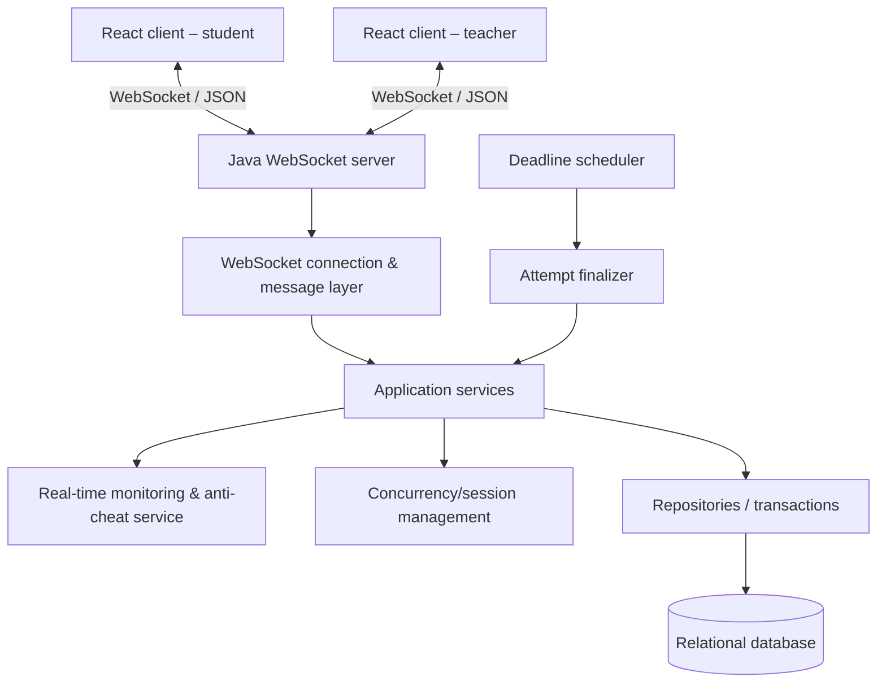

# Online Examination System

> **Java Programming Project – Topic 4: Java Concurrent Application**
>
> **Trạng thái:** kiến trúc đã được giảng viên làm rõ: **React web client ↔ WebSocket ↔ Java server ↔ relational database**. Bốn core features đã chốt là **real-time exam monitoring, auto-save & exam recovery, anti-cheating/suspicious-activity detection, question randomization**. Đây là tài liệu thiết kế/kế hoạch; không xem bất kỳ tính năng, lệnh chạy, test case hay số liệu nào là đã hoàn thành nếu chưa có source code và bằng chứng chạy thực tế.

## 1. Thông tin dự án

| Mục | Nội dung |
| --- | --- |
| Tên dự án | Online Examination System |
| Môn học | Java Software Development |
| Năm học | 2026–2027 |
| Hướng đề tài | Topic 4 – Java Concurrent Application |
| Nhóm | `TBD` |
| Giảng viên | `TBD` |
| Kiến trúc đã chọn | React client + WebSocket + Java server + relational database |

### Thành viên

| Mã sinh viên | Họ và tên | Trách nhiệm kỹ thuật chính |
| --- | --- | --- |
| `TBD` | `TBD` | `TBD` |
| `TBD` | `TBD` | `TBD` |
| `TBD` | `TBD` | `TBD` |

> Mỗi thành viên phải hiểu phần code được giao và luồng hệ thống. Trong vấn đáp, giảng viên có thể yêu cầu bất kỳ thành viên nào giải thích class/method, chạy một chức năng, sửa code hoặc debug lỗi.

## 2. Tổng quan

### 2.1. Bài toán

Một hệ thống thi trực tuyến cơ bản chỉ có đăng nhập, hiển thị câu hỏi, nộp bài và tính điểm chưa thể hiện đủ yêu cầu của Topic 4. Hệ thống này phải xử lý nhiều sinh viên cùng kết nối, vào thi, lưu đáp án, nhận thông báo thời gian và nộp bài trong cùng thời điểm mà không làm mất dữ liệu, chấm trùng hoặc tạo trạng thái không nhất quán.

Vì vậy concurrency là một phần cốt lõi của bài toán, không phải tính năng bổ sung. Java server chịu trách nhiệm về xác thực, luật nghiệp vụ, trạng thái lượt thi, deadline, chấm điểm, xử lý shared resources và tính đúng đắn của dữ liệu. React chỉ đảm nhiệm giao diện người dùng và giao tiếp thời gian thực với server.

### 2.2. Mục tiêu

- Xây dựng hệ thống thi trực tuyến đầy đủ cho sinh viên và giảng viên.
- Dùng React làm giao diện web cho hai vai trò.
- Dùng WebSocket cho giao tiếp hai chiều và sự kiện real-time.
- Dùng Java server để thể hiện OOP, SOLID, concurrency, exception handling và database programming.
- Cho phép nhiều phiên/lượt thi đồng thời nhưng giữ trạng thái nhất quán.
- Chống xử lý trùng khi sinh viên nộp bài đồng thời với deadline.
- Lưu dữ liệu bền vững trong relational database.
- Theo dõi bài thi real-time cho giảng viên, không phụ thuộc polling thủ công.
- Auto-save đáp án, phục hồi trạng thái/lượt thi sau disconnect-reconnect.
- Xáo câu hỏi/lựa chọn nhưng giữ mapping ID gốc để chấm chính xác.
- Ghi nhận anti-cheating/suspicious activity theo rule xác định, có thể giải thích và test.
- Kiểm thử correctness, WebSocket, concurrency, reliability và hiệu năng bằng bằng chứng thực tế.

### 2.3. Phạm vi phiên bản đầu

**Trong phạm vi:**

- React web client cho sinh viên và giảng viên.
- Java server nhận nhiều WebSocket connection.
- Giao thức message JSON qua WebSocket.
- Đăng ký/đăng nhập/đăng xuất và phân quyền `STUDENT`/`TEACHER`.
- Quản lý đề thi trắc nghiệm một đáp án đúng.
- Sinh viên bắt đầu thi, lưu/sửa đáp án, nộp bài hoặc bị tự chốt khi hết giờ.
- Auto-save đáp án qua WebSocket và phục hồi lượt thi sau reconnect.
- Random question order và option order theo từng lượt thi, đồng thời giữ question/choice ID gốc.
- Thông báo thời gian, cảnh báo và trạng thái thi từ server.
- Teacher monitoring dashboard cập nhật qua WebSocket: online, disconnected, reconnected, taking, submitted, warning và suspicious activity.
- Chấm tự động, kết quả, lịch sử thi và bảng xếp hạng theo chính sách công bố.
- Theo dõi và ghi nhận suspicious activity theo rule anti-cheating đã định nghĩa.
- Test concurrency và đo tải WebSocket.

**Ngoài phạm vi ban đầu:**

- Giao diện client bằng JavaFX hoặc Java console.
- Nhiều server, database phân tán hoặc high availability production.
- Webcam, khóa toàn màn hình tuyệt đối, nhận diện khuôn mặt hoặc tự động kết luận gian lận.
- Ứng dụng mobile native.
- Tự luận/chấm tay.
- Code-based examination/code execution; đây không thuộc core scope hiện tại và chỉ xem là future extension nếu có sandbox/isolation an toàn.
- Triển khai Internet công cộng khi chưa có HTTPS/WSS và cơ chế quản lý secret phù hợp.

## 3. Kiến trúc hệ thống

### 3.1. Kiến trúc đã chốt

Giảng viên đã xác nhận rằng với hệ thống client-server này, **Java server** là phần phải thể hiện kỹ thuật Java/OOP/concurrency; client được phép dùng **React**. WebSocket là cơ chế giao tiếp real-time chính, không thay bằng HTTP request/response thông thường cho các luồng thi/monitoring. Kiến trúc này không được đổi sang ứng dụng JavaFX/Swing-only nếu không có chỉ dẫn mới.



```text
React Client
     │
     │ WebSocket – JSON messages
     ▼
Java Server
     ├── Authentication and authorization
     ├── WebSocket connection/message handling
     ├── Exam management
     ├── Exam session and deadline management
     ├── Submission, grading and result processing
     ├── Concurrency and shared-state protection
     ├── Suspicious-activity monitoring
     └── Database access
             │
             ▼
      Relational database
```

### 3.2. Vai trò các thành phần

| Thành phần | Trách nhiệm |
| --- | --- |
| React client | Hiển thị giao diện, nhận thao tác, quản lý state UI, duy trì WebSocket client, gửi command và hiển thị event/response từ server. |
| WebSocket layer | Xác thực connection, nhận/validate/dispatch JSON message, gửi response hoặc event, quản lý lifecycle connect/disconnect/reconnect. |
| Application services | Giữ luật nghiệp vụ: quyền, đề thi, lượt thi, lưu đáp án, nộp bài, chấm, công bố kết quả và leaderboard. |
| Concurrency/session layer | Thread pool, scheduled job, session tracking, shared-state coordination, auto-save/recovery và randomization mapping. |
| Monitoring/anti-cheat layer | Tổng hợp trạng thái exam session, phát event real-time cho teacher, áp dụng rule suspicious activity và lưu activity record. |
| Repositories | SQL tham số hóa, mapping dữ liệu, transaction và query tổng hợp. |
| Database | Nguồn dữ liệu bền vững cho user, exam, attempt, answer, result và suspicious activity. |

### 3.3. Nguyên tắc kiến trúc

- Server là nguồn quyết định duy nhất về danh tính, quyền, thời gian, trạng thái lượt thi và điểm.
- React không được tự tính deadline hợp lệ, không giữ đáp án đúng và không quyết định liệu request có được chấp nhận.
- Mọi dữ liệu client gửi lên đều phải validate ở server, kể cả `examId`, `attemptId`, `questionId` và lựa chọn đáp án.
- WebSocket dùng cho message/event real-time; request không tin cậy chỉ vì nó đến từ connection đã mở.
- Không giữ database lock hoặc transaction trong khi chờ network I/O.
- Cache hoặc `ConcurrentHashMap` có thể hỗ trợ session/connection nhưng database là nguồn sự thật cho dữ liệu nghiệp vụ bền vững.
- Không được để core business logic, deadline, anti-cheating rule hay submission integrity nằm ở React state.

## 4. Người dùng và tính năng

### 4.1. Sinh viên

Sinh viên có thể:

- Đăng ký, đăng nhập và đăng xuất.
- Xem bài thi khả dụng và thông tin bài thi.
- Bắt đầu hoặc tiếp tục lượt thi hợp lệ.
- Nhận biến thể đề đã xáo, điều hướng câu hỏi và lưu/sửa đáp án khi còn thời gian.
- Xem connection status, auto-save status, recovery status và warning notification trong Exam Room.
- Nhận thông báo thời gian/trạng thái từ server.
- Nộp bài hoặc nhận thông báo server tự chốt khi hết giờ.
- Xem kết quả, lịch sử thi và bảng xếp hạng khi có quyền.
- Có hoạt động trong phiên thi được ghi nhận cho mục đích monitoring.

### 4.2. Giảng viên

Giảng viên có thể:

- Đăng nhập và truy cập các chức năng theo vai trò.
- Tạo, sửa, xóa, publish/unpublish hoặc đóng bài thi.
- Quản lý câu hỏi, lựa chọn, đáp án, thời lượng và thời điểm mở/công bố.
- Xem các lượt thi, bài nộp, điểm, kết quả và bảng xếp hạng.
- Theo dõi session thi và xem suspicious-activity report.
- Xem Teacher Monitoring Dashboard cập nhật real-time, không cần refresh thủ công.

### 4.3. Trang React dự kiến

| Vai trò | Trang/màn hình |
| --- | --- |
| Chung | Login, Register, Profile, connection/reconnect status |
| Sinh viên | Login, Register, Dashboard, Available Exams, Exam Information, Exam Room, Exam Result, Exam History, Leaderboard, Profile |
| Giảng viên | Dashboard, Exam Management, Create/Edit Exam, Question Management, Question Bank, **Exam Monitoring**, Submissions, Results, Suspicious Activity, Profile |

`Exam Room` phải thể hiện randomized questions, question navigation, answer input, remaining time, connection/auto-save/recovery status, warning và submit. `Exam Monitoring` là core page, không phải trang tùy chọn. Giao diện đẹp không thay thế cho concurrency, OOP, test hay đóng góp kỹ thuật.

## 5. Yêu cầu chức năng

| ID | Yêu cầu |
| --- | --- |
| FR01 | Người dùng đăng ký, đăng nhập, đăng xuất; server xác thực và phân quyền `STUDENT`/`TEACHER`. |
| FR02 | Giảng viên tạo, sửa, xóa, publish/unpublish bài thi; cấu hình tiêu đề, mô tả, thời lượng, thời điểm mở và chính sách công bố. |
| FR03 | Giảng viên quản lý câu hỏi, lựa chọn và đáp án của bài thi. |
| FR04 | Sinh viên xem bài thi khả dụng và chỉ bắt đầu lượt mới khi đúng quyền, đúng thời điểm và chưa vượt giới hạn lượt thi. |
| FR05 | Server tạo `startTime`/`deadline`, sinh biến thể đề theo lượt thi, trả nội dung không lộ đáp án đúng và duy trì trạng thái session thi. |
| FR06 | Sinh viên lưu/sửa đáp án trước hạn; mỗi thay đổi được auto-save qua WebSocket sau khi server kiểm tra ownership, trạng thái và thời gian. |
| FR07 | Sinh viên nộp bài hoặc server tự chốt theo deadline; cả hai dùng cùng một đường finalization. |
| FR08 | Server chấm, lưu kết quả, công bố theo policy; sinh viên xem kết quả/lịch sử khi được phép. |
| FR09 | Server gửi event real-time như trạng thái thi, cảnh báo, time update, nộp bài và kết quả qua WebSocket. |
| FR10 | Teacher Monitoring Dashboard nhận update real-time về tổng số, online, taking, submitted, disconnected, reconnected, warning và suspicious count; không cần refresh thủ công. |
| FR11 | Server random question order/option order hoặc chọn câu từ question bank theo policy, đồng thời lưu mapping ID gốc để resume/chấm đúng. |
| FR12 | `RESUME_EXAM` hoặc message tương đương phục hồi saved answers, question mapping, connection state và thời gian còn lại sau reconnect. |
| FR13 | `SuspiciousActivityService` áp dụng rule deterministic, lưu suspicious activity record và cho giảng viên xem qua dashboard. |

## 6. Yêu cầu phi chức năng

| ID | Yêu cầu |
| --- | --- |
| NFR01 | Java server phục vụ nhiều WebSocket client mà một connection chậm/lỗi không làm dừng các session khác. |
| NFR02 | Một `ExamAttempt` chỉ được chốt/chấm một lần dù nhận submit trùng hoặc trùng deadline job. |
| NFR03 | Server kiểm tra authentication, authorization, ownership, trạng thái và deadline cho mọi command. |
| NFR04 | Dữ liệu đã commit còn sau restart; deadline/session đang mở được khôi phục theo dữ liệu bền vững. |
| NFR05 | JSON không hợp lệ, message không hỗ trợ, disconnect hoặc lỗi client trả error/event an toàn và không làm chết server. |
| NFR06 | Mật khẩu được lưu hash; server không trả đáp án đúng, stack trace, SQL hay dữ liệu nhạy cảm không cần thiết. |
| NFR07 | Bảng xếp hạng chỉ dùng attempt terminal đã commit, không trùng sinh viên và có tie-break ổn định. |
| NFR08 | Suspicious activity có thời điểm server, user/session/attempt, event type và chỉ giảng viên được xem. |
| NFR09 | Socket/session/resource JDBC được đóng đúng vòng đời; không có deadlock hoặc resource leak đã biết. |
| NFR10 | React UI hiển thị loading/reconnect/error rõ ràng; WebSocket lifecycle không làm UI bị kẹt hoặc tạo connection trùng. |
| NFR11 | Source có cấu trúc rõ, tên có nghĩa, xử lý exception phù hợp, không debug/dead code khi nộp. |
| NFR12 | Auto-save, reconnect/recovery và randomization không làm mất mapping question ID, saved answer hoặc reset deadline. |
| NFR13 | Monitoring/anti-cheating chỉ đưa ra warning/suspicious signal theo rule có thể kiểm tra; không tuyên bố phát hiện gian lận tuyệt đối. |

## 7. WebSocket protocol

### 7.1. Quy ước transport

- Client-server communication: WebSocket.
- Payload: UTF-8 JSON object.
- Connection: `ws://` chỉ cho localhost/demo; dùng `wss://` khi triển khai qua mạng thật.
- Mỗi client message có `requestId`, `type`, `payload`; server response/event có `type`, `requestId` khi liên quan đến request, `data` hoặc `error`.
- Client xử lý reconnect theo policy; reconnect không được tạo attempt mới hoặc nới deadline.
- Authentication/connection handshake và token/session rule sẽ được ghi chi tiết trong `docs/protocol.md` sau khi chọn thư viện server.

### 7.2. Command và event dự kiến

| Client → Server | Server → Client |
| --- | --- |
| `AUTHENTICATE` | `AUTHENTICATED`, `AUTH_ERROR` |
| `JOIN_EXAM`, `RESUME_EXAM` | `EXAM_STARTED`, `QUESTION_DATA`, `EXAM_STATE` |
| `ANSWER_QUESTION` | `ANSWER_SAVED`, `ERROR` |
| `SUBMIT_EXAM` | `EXAM_SUBMITTED`, `RESULT` |
| `HEARTBEAT` | `HEARTBEAT_ACK`, `TIME_UPDATE` |
| `LEAVE_EXAM` | `WARNING`, `EXAM_ENDED` |
| Teacher monitor subscription/query | `MONITORING_UPDATE`, `STUDENT_STATUS_UPDATED`, `STUDENT_WARNING` |
| Query commands | `LEADERBOARD`, `SUSPICIOUS_ACTIVITY`, `ERROR` |

### 7.3. Message envelope

Client command:

```json
{
  "requestId": "req-123",
  "type": "ANSWER_QUESTION",
  "payload": {
    "attemptId": 42,
    "questionId": 20,
    "answer": "A"
  }
}
```

Server response:

```json
{
  "requestId": "req-123",
  "type": "ANSWER_SAVED",
  "data": {
    "attemptId": 42,
    "questionId": 20,
    "savedAt": "2026-10-05T09:12:32Z"
  }
}
```

Server event:

```json
{
  "type": "TIME_UPDATE",
  "data": {
    "attemptId": 42,
    "remainingSeconds": 1250
  }
}
```

Server error:

```json
{
  "requestId": "req-123",
  "type": "ERROR",
  "error": {
    "code": "ATTEMPT_NOT_ACCESSIBLE",
    "message": "The attempt is not accessible."
  }
}
```

`requestId` hỗ trợ React ghép response với command đã gửi và hỗ trợ truy vết log. Error message không được tiết lộ đáp án, password, stack trace hoặc SQL.

### 7.4. Event monitoring dự kiến

Teacher Monitoring Dashboard chỉ subscribe đến event cần thiết cho exam mà teacher có quyền xem. Các event có thể gồm:

```text
STUDENT_CONNECTED
STUDENT_DISCONNECTED
STUDENT_RECONNECTED
STUDENT_SUBMITTED
STUDENT_WARNING
STUDENT_STATUS_UPDATED
MONITORING_UPDATE
```

Không bắt buộc hiện thực từng tên event trên. Trước khi code phải chốt contract thống nhất, payload tối thiểu, authorization, thứ tự event và xử lý reconnect. Dashboard phải được server push update qua WebSocket, không dùng polling-only trừ khi có lý do kỹ thuật được ghi rõ.

## 8. Concurrency design

### 8.1. Thread model dự kiến

| Thread/executor | Công việc | Shared resources liên quan |
| --- | --- | --- |
| WebSocket I/O/container threads | Nhận connection, frame và dispatch message. | Connection/session registry. |
| Application executor | Chạy task nghiệp vụ nặng hoặc async theo kiến trúc thư viện server. | Services, repositories, database. |
| `ScheduledExecutorService` | Deadline, heartbeat/session cleanup và job recovery. | Attempt đang mở, session state. |
| Test/load executors | Tạo nhiều WebSocket client đồng thời trong test/benchmark. | Chỉ dùng cho tooling. |

Cách dùng thread/container/executor cuối cùng phải được mô tả đúng theo thư viện WebSocket Java đã chọn. Không thêm thread chỉ để làm dự án trông phức tạp.

### 8.2. Shared resources

- Active WebSocket connections và online-user/session registry.
- Trạng thái `ExamAttempt`.
- Câu trả lời đã lưu.
- Giới hạn lượt thi và một phiên thi đang hoạt động theo tài khoản.
- Deadline scheduler registry.
- Submission/result state.
- Leaderboard query/result snapshot.
- Suspicious activity records.

### 8.3. Race condition quan trọng nhất: chốt bài

Hai nguồn có thể cùng chốt một lượt thi:

```text
WebSocket SUBMIT_EXAM command ──┐
                                ├── AttemptFinalizer
Deadline scheduler job ─────────┘
```

Transition hợp lệ duy nhất là:

```text
IN_PROGRESS → SUBMITTED
```

Nguồn chốt (`USER` hoặc `DEADLINE`) được lưu metadata riêng. Cả hai đường phải dùng cùng `AttemptFinalizer`, transaction và conditional update/row lock. Chỉ task thắng được quyền chấm và ghi kết quả; task đến sau đọc kết quả đã có thay vì chấm thêm lần nữa.

Một phương án cần được kiểm chứng với database đã chọn:

```sql
UPDATE exam_attempts
SET status = 'SUBMITTED',
    submitted_at = ?,
    submission_source = ?
WHERE id = ?
  AND status = 'IN_PROGRESS';
```

Nếu số dòng update là `1`, task giành quyền finalization. Nếu là `0`, attempt đã được chốt hoặc không hợp lệ. Chấm điểm và lưu kết quả phải có transaction boundary chính xác; chi tiết cuối chỉ được mô tả là “đã hoàn thành” sau khi integration/concurrency test chứng minh.

### 8.4. Quy tắc sát deadline

- `ANSWER_QUESTION` chỉ hợp lệ khi server time nhỏ hơn `deadline` và attempt còn `IN_PROGRESS`.
- Tại hoặc sau deadline, server từ chối đáp án mới và finalizer chịu trách nhiệm chốt lượt.
- Countdown React chỉ phục vụ hiển thị; server clock quyết định tính hợp lệ.
- Kiểm tra deadline, ownership, status và ghi đáp án phải được phối hợp đúng trong transaction/service.

### 8.5. Khởi động lại và reconnect

- Câu trả lời và deadline được lưu database, không chỉ ở React state hoặc RAM server.
- Reconnect xác minh session/user/attempt rồi trả state hiện tại; không xáo lại đề hoặc tạo deadline mới.
- Khi Java server khởi động, đọc các attempt đang mở.
- Attempt quá hạn đi qua `AttemptFinalizer`; attempt còn hạn được đăng ký lại scheduler.
- Disconnect/reconnect và heartbeat có thể tạo audit event theo policy sau này chốt.

## 9. Thiết kế Java, OOP và SOLID

### 9.1. Module/class Java dự kiến

| Nhóm | Thành phần | Trách nhiệm |
| --- | --- | --- |
| WebSocket | `ExamWebSocketEndpoint`, `ConnectionManager`, `MessageDispatcher` | Lifecycle connection, parse/validate message và gửi response/event. |
| Service | `AuthenticationService`, `ExamService`, `AttemptService`, `SubmissionService`, `GradingService` | Luật nghiệp vụ cốt lõi. |
| Service | `SessionManager`, `LeaderboardService`, `MonitoringService`, `SuspiciousActivityService` | Session, dashboard monitoring, xếp hạng và anti-cheating rule. |
| Randomization | `ExamGenerator`, `QuestionRandomizationService` | Chọn/xáo câu hỏi-lựa chọn và lưu mapping cố định theo attempt. |
| Concurrency | `DeadlineScheduler`, `AttemptFinalizer`, `ExecutorConfig` | Scheduler, finalization dùng chung và executor lifecycle. |
| Domain | `User`, `Student`, `Teacher`, `Exam`, `Question`, `Choice`, `ExamAttempt`, `StudentAnswer`, `Result`, `SuspiciousActivity` | Mô hình nghiệp vụ và invariant. |
| Repository | `UserRepository`, `ExamRepository`, `AttemptRepository`, `AnswerRepository`, `ResultRepository`, `AuditRepository` | Abstraction truy cập dữ liệu. |
| Persistence | `Jdbc*Repository` hoặc implementation phù hợp công nghệ chốt | SQL, transaction và mapping dữ liệu. |
| Protocol | `ClientMessage`, `ServerMessage`, `MessageType`, request/response DTO, `ErrorCode` | Contract message JSON. |

Tên class/interface cuối cùng có thể đổi theo thư viện được chọn, nhưng trách nhiệm phải giữ tách bạch.

### 9.2. OOP

- **Encapsulation:** `ExamAttempt` bảo vệ status/invariant; code ngoài không sửa terminal state trực tiếp.
- **Abstraction:** service phụ thuộc repository interface và clock/transaction abstraction phù hợp.
- **Composition:** `Exam` gồm question/choice; `ExamAttempt` gồm snapshot và student answers.
- **Inheritance/polymorphism:** có thể dùng `User → Student/Teacher` hoặc strategy cho grading/anti-cheat khi thật sự phù hợp; không tạo hierarchy giả để đủ rubric.
- **Interfaces:** tách endpoint/protocol, service và persistence để test dễ hơn.
- **Exception handling:** phân biệt validation, authentication, authorization, conflict, timeout, protocol và internal error.

### 9.3. SOLID

- **SRP:** WebSocket endpoint chỉ giao tiếp; service giữ luật; repository giữ persistence; React giữ UI state.
- **OCP:** message handler/rule mới có thể thêm mà không phá finalization hiện có.
- **LSP:** các implementation repository/service tuân thủ contract chung.
- **ISP:** interface nhỏ theo use case, tránh một service/repository khổng lồ.
- **DIP:** service phụ thuộc abstraction thay vì implementation JDBC/library cụ thể.

## 10. Database và dữ liệu

### 10.1. Công nghệ

Database relational và cách truy cập Java sẽ được chốt trước khi code. Hướng mặc định để demo là H2 embedded/file mode qua JDBC, nhưng chỉ xác nhận là công nghệ cuối khi nhóm kiểm tra compatibility với WebSocket server và yêu cầu giảng viên. Không commit database thật, mật khẩu thật hay secret.

### 10.2. Thực thể dự kiến

| Thực thể | Mục đích |
| --- | --- |
| `users` | Tài khoản, password hash, role, display name. |
| `exams` | Thông tin đề, thời lượng, publish state và policy công bố. |
| `questions` / `choices` | Nội dung trắc nghiệm; đáp án đúng chỉ dùng phía server. |
| `exam_attempts` | Sinh viên, start/deadline, status, submission source/time và score. |
| `attempt_questions` / `attempt_choice_order` | Mapping question/choice gốc với thứ tự/biến thể cố định của từng attempt. |
| `student_answers` | Đáp án theo attempt/question. |
| `results` | Kết quả công bố nếu tách khỏi attempt. |
| `suspicious_activities` | Rule, event type, severity, timestamp, attempt/session và dữ liệu monitoring cần giảng viên xem xét. |
| `activity_logs` | Activity event tổng quát nếu tách khỏi suspicious record để phục vụ monitoring/audit. |
| `sessions` | Phiên xác thực nếu cần persistent session. |

Schema cuối phải có primary key, foreign key, constraint/index và transaction boundary phục vụ các invariant concurrency. ERD và SQL thật để trong `database/` hoặc `server/src/main/resources/db/` sau khi quyết định cấu trúc source cuối.

## 11. Bốn core features và novelty đã chốt

Novelty của project là một hệ thống thi real-time có **monitoring, auto-save/recovery, suspicious-activity detection và question randomization** được thiết kế tích hợp. Đây không phải bốn feature rời rạc:

```text
Active exam
    ├── Randomized question/option mapping
    ├── Student answer changes → auto-save
    ├── Connection/activity events
    └── Server-side exam session
                 │
                 ▼
         Java Server services
                 │
       ┌─────────┼──────────┐
       ▼         ▼          ▼
  Recovery   Monitoring  Suspicious rules
       │         │          │
       └─────────┴──────────┘
                 ▼
    Teacher Monitoring Dashboard
```

### 11.1. Real-time exam monitoring

Teacher Monitoring Dashboard phải cập nhật qua WebSocket khi exam đang hoạt động, không cần giảng viên refresh trang thủ công. Với từng exam, dashboard hiển thị ít nhất:

- Tổng số sinh viên/thí sinh được phép hoặc đã tham gia.
- Số đang connected, đang làm bài, đã nộp, disconnected, reconnected.
- Trạng thái gần nhất của từng sinh viên, ví dụ `Answering Q5`, `Reconnected`, `Submitted`.
- Warning count và suspicious activity count.
- Danh sách/số lượng event để teacher có thể xem chi tiết.

Monitoring state là dữ liệu server tổng hợp từ session/activity event; React chỉ render dữ liệu server push. Cần xác định rõ quyền: teacher chỉ nhận monitoring data của exam mình sở hữu hoặc được phân quyền xem.

### 11.2. Auto-save và exam recovery

Auto-save không chỉ là lưu state React trước khi bấm submit. Luồng bắt buộc là:

```text
Student changes answer
        ↓ WebSocket ANSWER_QUESTION
Java Server validates user + attempt + deadline + question
        ↓
Update authoritative exam session state
        ↓
Persist StudentAnswer in database
        ↓
ANSWER_SAVED event/response to React
```

Khi mất kết nối:

```text
Exam in progress → connection lost → reconnect → RESUME_EXAM
    → server validates identity/session/attempt
    → server returns saved answers, question mapping, status and deadline
    → React restores UI and continues the same attempt
```

Các invariant bắt buộc:

- Server clock quyết định thời gian còn lại; reconnect không reset deadline.
- Saved answers phải được persist an toàn và state khôi phục lấy từ server/database.
- Attempt đã terminal không nhận đáp án mới.
- Answer sau expiration bị từ chối.
- Concurrent answer update không được corrupt state.
- Reconnect không tạo attempt mới hoặc thay biến thể đề.

### 11.3. Anti-cheating / suspicious-activity detection

`SuspiciousActivityService` hoặc abstraction tương đương là component riêng, không rải rule vào WebSocket endpoint, React component hoặc repository không liên quan.

Các activity event tiêu biểu:

```text
STUDENT_CONNECTED
EXAM_STARTED
EXAM_LEFT
EXAM_RECONNECTED
ANSWER_CHANGED
EXAM_SUBMITTED
EXAM_TIMEOUT
SUSPICIOUS_ACTIVITY
```

Rule ban đầu phải deterministic, cấu hình được và test được. Ví dụ candidate để nhóm chốt cụ thể:

- Repeated disconnect/reconnect vượt ngưỡng trong một khoảng thời gian.
- Connection behavior bất thường theo rule rõ ràng.
- Repeated unusual submission behavior hoặc request sau deadline.
- Cố truy cập attempt của sinh viên khác.

Mỗi suspicious record cần thời điểm server, user, exam/attempt/session liên quan, event type, rule/mô tả và severity phù hợp. Teacher xem được record qua Monitoring Dashboard.

**Giới hạn trung thực:** đây là cảnh báo theo rule kỹ thuật, không phải bằng chứng tự động chứng minh hay kết luận sinh viên gian lận. Web client không thể xác minh chắc chắn hành vi dùng điện thoại, tài liệu ngoài màn hình hoặc người làm hộ.

### 11.4. Question randomization

System hỗ trợ một hoặc nhiều policy được chốt trong implementation:

- Random question order.
- Random answer-option order.
- Random question selection từ question bank.

Mô hình khái niệm:

```text
Question bank
      ↓
Exam generator
      ↓
Randomized exam instance
      ↓
Student exam session/attempt
```

Khi student bắt đầu attempt, server tạo/lưu mapping cố định của question và option order cho attempt đó. Client nhận thứ tự hiển thị nhưng vẫn gửi `questionId`/`choiceId` gốc. Sau reconnect, server trả đúng mapping cũ; grading dùng ID gốc chứ không dùng vị trí hiển thị. Không chỉ shuffle UI rồi làm mất identity dữ liệu.

### 11.5. Code-based examination

**Không thuộc core scope hiện tại.** Đây chỉ là future extension vì việc thực thi code sinh viên cần sandbox/isolation, time/memory limit và security model riêng.

## 12. Kết quả và bảng xếp hạng

- Một bảng cho mỗi bài thi.
- Mỗi sinh viên một dòng, dùng điểm cao nhất từ các attempt `SUBMITTED` đã commit nếu policy cho phép thi lại.
- Hòa điểm: thời gian làm của lượt đạt điểm cao nhất ngắn hơn → nộp sớm hơn → student ID tăng dần.
- Không đưa attempt đang thi hoặc chưa commit vào leaderboard.
- Giảng viên luôn xem được; sinh viên chỉ xem sau publication policy.
- Chỉ hiển thị display name/alias, không công khai email hoặc thông tin nhạy cảm.

## 13. Cấu trúc repository mục tiêu

```text
online-examination-system/
├── README.md
├── client/                              # React application
│   ├── package.json
│   ├── src/
│   │   ├── components/
│   │   ├── pages/
│   │   │   ├── student/
│   │   │   └── teacher/
│   │   ├── layouts/
│   │   ├── services/
│   │   ├── websocket/
│   │   ├── hooks/
│   │   ├── context/
│   │   ├── types/
│   │   ├── features/
│   │   │   ├── exam-room/
│   │   │   └── monitoring/
│   │   ├── utils/
│   │   └── assets/
│   └── README.md
├── server/                              # Java application
│   ├── pom.xml
│   └── src/
│       ├── main/
│       │   ├── java/vn/edu/hanu/exam/
│       │   │   ├── config/
│       │   │   ├── websocket/
│       │   │   ├── controller/
│       │   │   ├── service/
│       │   │   ├── domain/
│       │   │   ├── repository/
│       │   │   ├── dto/
│       │   │   ├── concurrency/
│       │   │   ├── monitoring/
│       │   │   ├── randomization/
│       │   │   ├── security/
│       │   │   ├── exception/
│       │   │   └── util/
│       │   └── resources/
│       └── test/
│           └── java/vn/edu/hanu/exam/
├── database/
│   ├── schema.sql
│   └── seed-demo.sql
├── docs/
│   ├── requirements.md
│   ├── architecture.md
│   ├── protocol.md
│   ├── database.md
│   ├── test-plan.md
│   └── experiments.md
└── report/
    └── GroupXX_OnlineExaminationSystem_Report.docx
```

Đây là cấu trúc mục tiêu, không phải xác nhận rằng các file đã tồn tại. Không tạo framework/server/client chỉ để đủ folder; cấu trúc phải phản ánh code thật.

## 14. Công nghệ và môi trường

### 14.1. Công nghệ dự kiến

| Khu vực | Công nghệ | Trạng thái |
| --- | --- | --- |
| Client | React; JavaScript hoặc TypeScript | TODO / DECISION REQUIRED: TypeScript hay JavaScript |
| Real-time protocol | WebSocket + JSON | Đã chốt |
| Server | Java 21 + Maven | Đã định hướng |
| WebSocket server library | Java-compatible library/framework | TODO / DECISION REQUIRED |
| Persistence | Relational DB + JDBC hoặc giải pháp Java được duyệt | TODO / DECISION REQUIRED |
| Testing server | JUnit 5 và test integration/concurrency | Dự kiến |
| Testing client | Component/integration test phù hợp React | Dự kiến |
| Source control | Git | Bắt buộc dùng |

### 14.2. Cài đặt/build/run

> **Chưa khả dụng:** workspace hiện chưa có client/server build files hoặc main application đã xác minh. Các lệnh bên dưới là hợp đồng tài liệu cần được thay bằng lệnh đã chạy thật sau khi source được tạo.

Quy trình mục tiêu:

1. Cài JDK 21, Maven, Node.js/npm và Git.
2. Cài dependencies React trong `client/`.
3. Cài dependencies Java trong `server/`.
4. Cấu hình database local từ file example; không commit secret.
5. Chạy database schema/seed demo.
6. Khởi động Java WebSocket server.
7. Khởi động React development server.
8. Mở nhiều browser session/client automation để test WebSocket/concurrency.

Các command chính xác chỉ được thêm sau khi nhóm chọn build tools/libraries và tự kiểm tra trên môi trường sạch.

## 15. Kế hoạch kiểm thử

### 15.1. Môi trường cần ghi nhận

- OS, CPU/RAM, JDK, Maven, Node.js/npm và browser version.
- Commit hash và cấu hình database.
- Java executor/pool/scheduler configuration.
- WebSocket library/server configuration.
- Số concurrent client, workload, warm-up và số lần lặp.

### 15.2. Test cases

| ID | Trường hợp | Input/thiết lập | Kết quả kỳ vọng | Kết quả thực tế | Trạng thái |
| --- | --- | --- | --- | --- | --- |
| TC01 | Authentication | Tài khoản hợp lệ/không hợp lệ | Đăng nhập hoặc error đúng, role đúng | Chưa chạy | NOT RUN |
| TC02 | Quản lý đề | Teacher tạo/sửa/publish đề hợp lệ | Dữ liệu và quyền đúng | Chưa chạy | NOT RUN |
| TC03 | Tham gia thi | Student vào đề khả dụng | Tạo/tiếp tục đúng một attempt hợp lệ | Chưa chạy | NOT RUN |
| TC04 | Auto-save đáp án | `ANSWER_QUESTION` khi còn hạn | Answer được persist, `ANSWER_SAVED` đúng và UI có thể khôi phục | Chưa chạy | NOT RUN |
| TC05 | Nộp bài hợp lệ | Một attempt đang mở submit qua WebSocket | Attempt terminal, chấm/lưu kết quả đúng | Chưa chạy | NOT RUN |
| TC06 | Submit trùng | Hai `SUBMIT_EXAM` đồng thời cho một attempt | Chỉ một finalization/chấm/ghi điểm | Chưa chạy | NOT RUN |
| TC07 | Submit trùng deadline | Submit user và scheduler job chạy gần đồng thời | Một trạng thái/kết quả terminal | Chưa chạy | NOT RUN |
| TC08 | Lưu sát hoặc sau deadline | `ANSWER_QUESTION` khi server time ≥ deadline | Từ chối; dữ liệu không bị đổi sau chốt | Chưa chạy | NOT RUN |
| TC09 | Auto-save/reconnect/recovery | Ngắt WebSocket sau khi lưu, rồi `RESUME_EXAM` | Attempt/deadline/question mapping/saved answers được khôi phục đúng | Chưa chạy | NOT RUN |
| TC10 | Restart server | Restart khi có attempt mở | Khôi phục/chốt deadline đúng | Chưa chạy | NOT RUN |
| TC11 | Ownership | Student A gửi `attemptId` của B | Từ chối an toàn, ghi audit phù hợp | Chưa chạy | NOT RUN |
| TC12 | Nhiều WebSocket client | 10/50/N client cùng join/save/submit | Session độc lập, không mất dữ liệu | Chưa chạy | NOT RUN |
| TC13 | Invalid protocol | JSON/type/payload không hợp lệ | Error đúng, server/connection xử lý theo policy | Chưa chạy | NOT RUN |
| TC14 | Leaderboard concurrent read | Nhiều submit chạy khi query leaderboard | Chỉ dữ liệu committed, không duplicate | Chưa chạy | NOT RUN |
| TC15 | Publication policy | Student/teacher đọc result trước/sau hạn | Quyền công bố chính xác | Chưa chạy | NOT RUN |
| TC16 | Real-time monitoring | Teacher subscribe dashboard, students join/save/disconnect/submit | Dashboard nhận update WebSocket đúng, không cần manual refresh | Chưa chạy | NOT RUN |
| TC17 | Question randomization | Hai student bắt đầu/reconnect cùng exam | Mapping question/option có thể khác nhau nhưng ổn định theo attempt và chấm đúng ID gốc | Chưa chạy | NOT RUN |
| TC18 | Suspicious activity rule | Tạo disconnect/reconnect hoặc rule event vượt ngưỡng | `SuspiciousActivityService` tạo record/warning deterministic, teacher xem được | Chưa chạy | NOT RUN |
| TC19 | Concurrent auto-save | Nhiều client, hoặc nhiều update cạnh tranh trên một attempt theo policy | Không corrupt answer state; ownership/deadline/status đúng | Chưa chạy | NOT RUN |

Test race condition phải tạo tranh chấp chủ đích bằng executor/latch/barrier hoặc WebSocket test clients tự động, không chỉ thao tác tay trên hai browser.

## 16. Đánh giá thực nghiệm

### 16.1. Kịch bản

1. Baseline xử lý tuần tự hoặc cấu hình concurrency tối thiểu phù hợp kiến trúc.
2. Concurrent Java server với executor/pool đã chọn.
3. 10, 25, 50, 100 WebSocket client hoặc mức tải thực tế máy hỗ trợ.
4. Kịch bản đồng thời join exam, save answers và submit.
5. Lặp nhiều lần sau warm-up và công bố số lần lặp thật.

### 16.2. Metrics

- Response time p50/p95 cho command WebSocket quan trọng.
- Throughput command/second hoặc completed attempts/second.
- Số connection/request/attempt thành công.
- Error/timeout/disconnect rate.
- Tổng thời gian xử lý workload.
- CPU/memory nếu công cụ cho phép.
- Số duplicate submissions hoặc invariant violation, kỳ vọng bằng `0`.

Kết quả thật được lưu trong `docs/experiments.md` bằng bảng/chart/log có nguồn. Không thay kỳ vọng bằng số liệu giả.

## 17. Đóng góp kỹ thuật dự kiến

Chỉ ghi “đã thực hiện” khi code/test/measurement chứng minh:

1. **Real-time concurrency-safe exam session:** xử lý WebSocket nhiều client và trạng thái attempt nhất quán.
2. **Idempotent attempt finalization:** submit user và deadline đi qua cùng transaction path, không chấm trùng.
3. **Auto-save & exam recovery:** persist từng thay đổi đáp án và phục hồi authoritative state/deadline/mapping sau reconnect hoặc restart.
4. **Question randomization with stable identity:** biến thể theo attempt, mapping ID gốc bền vững và chấm đúng sau reconnect.
5. **Anti-cheating/monitoring mechanism:** rule deterministic, activity record, real-time teacher dashboard và giới hạn được trình bày trung thực.
6. **Repeatable WebSocket concurrency tests:** tạo tranh chấp/tải đồng thời có kiểm soát.
7. **Concurrency-safe leaderboard:** query dữ liệu đã commit với tie-break ổn định.

## 18. Code quality, Git và tài liệu

- Dùng Git với branch/commit có ý nghĩa; không tạo lịch sử giả.
- Branch gợi ý: `feature/authentication`, `feature/websocket`, `feature/concurrency`, `feature/anti-cheat`, `feature/react-client`, `feature/database`, `feature/testing`.
- Ghi nhận bug, refactoring, duplicate code bị loại bỏ, tối ưu transaction/query/pool và bằng chứng trước/sau nếu có.
- README phải có lệnh build/run/test đã xác minh ở phiên bản cuối.
- Báo cáo phải mô tả đúng source, kết quả test và experiment thực tế.

## 19. Giới hạn và hướng phát triển

### Giới hạn

- Client web không thể xác minh toàn diện hoạt động của sinh viên ngoài hệ thống.
- Một Java server là single point of failure.
- Database/library cụ thể chưa chốt ở giai đoạn thiết kế.
- Code execution là rủi ro bảo mật lớn và không thuộc phiên bản đầu nếu chưa có isolation.
- Chưa có WSS/TLS production, mobile app hoặc hệ thống phân tán.

### Hướng phát triển

- Hoàn thiện rule anti-cheating, ngưỡng cảnh báo và evaluation dựa trên số liệu thực.
- HTTPS/WSS, token rotation, rate limiting và observability.
- Câu hỏi nhiều dạng, chấm tay hoặc code runner sandboxed.
- Database production, connection pooling và multi-server design.
- Real-time teacher monitoring nâng cao sau khi core correctness ổn định.

## 20. Trạng thái dự án và quyết định

### Đã chốt

- [x] Topic 4 – Java Concurrent Application.
- [x] Online Examination System theo kiến trúc client-server.
- [x] React web client + WebSocket + Java server + relational database.
- [x] Java server là thành phần kỹ thuật chính chịu trách nhiệm OOP, concurrency, authoritative exam state và persistence.
- [x] Real-time monitoring là core feature; teacher dashboard nhận WebSocket update, không polling-only.
- [x] Auto-save & exam recovery là core feature.
- [x] Anti-cheating/suspicious-activity detection là novelty/core feature.
- [x] Question randomization là core feature.
- [x] Code execution/code-based examination không thuộc scope core hiện tại.

### TODO / DECISION REQUIRED

- [ ] React dùng TypeScript hay JavaScript.
- [ ] Java WebSocket library/framework cụ thể.
- [ ] Relational database và persistence approach cụ thể.
- [ ] Anti-cheating rules, threshold, severity và evaluation metric cụ thể.
- [ ] Randomization policy: chỉ order, option order hay question-bank selection.
- [ ] Session authentication/token và reconnect policy chi tiết.
- [ ] Database schema, class diagram và final WebSocket contract.
- [ ] Phân công thành viên, test tooling và load-generation method.

### Current implementation status

Tại thời điểm cập nhật README, workspace chưa có source React/Java server, build file hay database schema để xác minh. Thư mục `stitch_university_online_examination_system/` chỉ chứa mockup UI tĩnh/design guideline; không phải React implementation. Mọi feature phía trên là specification mục tiêu cho lần triển khai tiếp theo.

## 21. Kế hoạch triển khai

1. Chốt FR/NFR chi tiết, anti-cheating rule/threshold và policy exam/session.
2. Chốt React TypeScript/JavaScript, Java WebSocket library và database (**TODO / DECISION REQUIRED**).
3. Thiết kế `ExamSession` state, randomization mapping, WebSocket protocol, error code, database schema và OOP/domain model.
4. Thiết kế concurrency model: executor, shared resources, locking/transaction và scheduler lifecycle.
5. Thiết kế React pages, đặc biệt Exam Room và Teacher Monitoring Dashboard.
6. Tạo skeleton client/server/database và WebSocket connection/message foundation.
7. Hiện thực authentication/authorization và exam/question management.
8. Hiện thực exam session, randomization, answer auto-save và `RESUME_EXAM` recovery.
9. Hiện thực `AttemptFinalizer`, deadline scheduler, restart recovery và duplicate-submit protection.
10. Hiện thực real-time monitoring và `SuspiciousActivityService` sau khi core session flow đúng.
11. Viết unit, integration, WebSocket, monitoring và concurrency tests.
12. Xây load test, đo sequential/concurrent và tối ưu bằng số liệu.
13. Hoàn thiện README, docs, report, demo và viva preparation.

## 22. Báo cáo và nộp bài

Báo cáo theo technical paper: Title, Abstract, Keywords, Introduction, Problem Definition, Requirements, Architecture, Design, Implementation, Technical Details, Testing, Experimental Results, Discussion, Novelty/Contributions, Limitations, Future Work, Conclusion, References và Appendix nếu cần.

Tên file:

```text
report/GroupXX_OnlineExaminationSystem_Report.docx
```

- Kiểm tra Compilatio; similarity yêu cầu `≤ 20%`.
- Trích dẫn nguồn, thư viện, code/ý tưởng tái sử dụng.
- Nộp `source/` hoặc cấu trúc client/server/database hoàn chỉnh, `report/` và `README.md` qua LMS theo hướng dẫn giảng viên.
- Deadline lấy từ LMS.

## 23. Checklist cuối

### Kiến trúc và source

- [x] Chọn React client + WebSocket + Java server + relational database.
- [ ] Chốt React TypeScript/JavaScript, WebSocket library và database cụ thể.
- [ ] Client/server/database build và chạy thành công trên môi trường sạch.
- [ ] Protocol được ghi rõ và client/server tuân thủ cùng contract.
- [ ] Không commit secret, database thật, build output hoặc debug code.

### Kỹ thuật

- [ ] OOP/SOLID được hiện thực bằng class thật.
- [ ] Thread model, shared resources, race conditions và synchronization khớp code.
- [ ] WebSocket lifecycle, disconnect/reconnect và invalid message được xử lý.
- [ ] Submit/deadline không chấm trùng.
- [ ] Restart/recovery giữ dữ liệu và deadline đúng.
- [x] Novelty đã chốt: anti-cheating/suspicious-activity detection tích hợp với monitoring.
- [ ] Auto-save/recovery, real-time monitoring, anti-cheating và randomization được hiện thực, test và giải thích được.

### Test, báo cáo và nộp bài

- [ ] Test case có input, expected, actual result và status.
- [ ] Unit, integration, WebSocket, database và concurrency tests đã chạy.
- [ ] Có benchmark tái lập được và số đo thật.
- [ ] README có lệnh build/run/test đã xác minh.
- [ ] Báo cáo `.docx` khớp source, có references và Compilatio `≤ 20%`.
- [ ] Mọi thành viên có thể chạy, giải thích và debug phần mình phụ trách.
- [ ] Nộp đầy đủ qua LMS đúng hạn.
